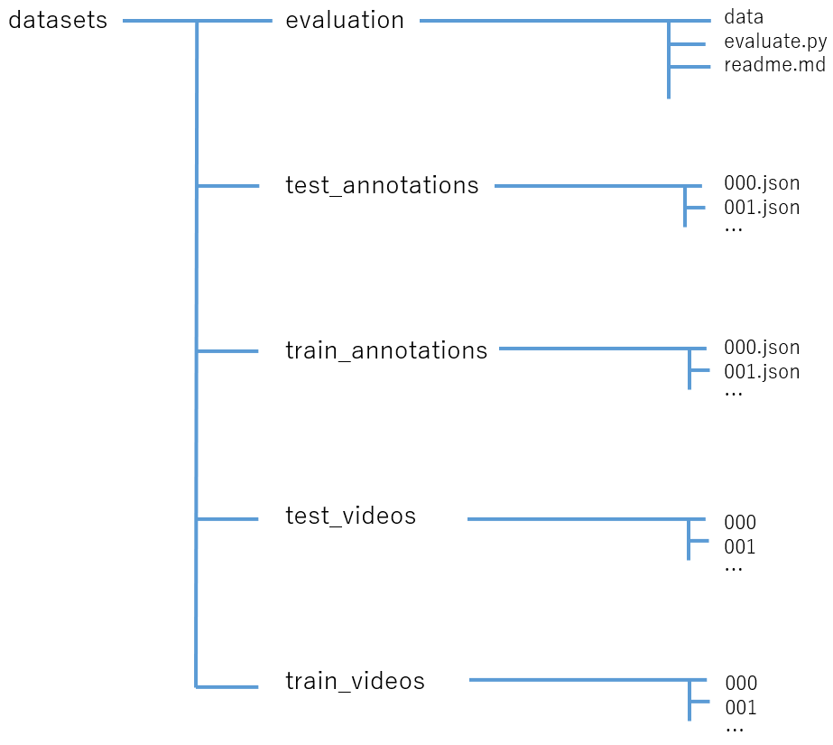

## 概要
SIGNATEのSUBARU画像認識チャレンジ用のデータセット確認GUIツール 
視聴したいデータのフォルダ番号をテキストボックスに入力すると、左カメラ画像、右カメラ画像、視差画像を縦方向に並べて表示する。
再生、ストップ、スライダーによる任意のフレーム選択が可能。

  

## 事前準備
### 1. データセットのフォルダ構成
データセットを格納したフォルダ構成を下図の構成に変更 

### 2. データセットパスの設定
config.pyのVIDEOS_PATHをtrain_videosもしくはtest_videosまでのパスに設定 
例：**VIDEOS_PATH: str = 'C:/datasets/train_videos'**

### 3. FPSの設定
config.pyのFPSを変更する 
元のデータは10FPSの設定であるため、初期値は10。

### 4. 再生ウィンドウの大きさを変更
config.pyのIMAGE_Wを変更する 
今回、3つの画像を縦方向に並べるために、アスペクト比/解像度が異なる3つの画像に対して、各画像のアスペクト比は保ったまま横幅を統一した。
そのため、IMAGE_Wを変更することで縦方向のウィンドウサイズも変更可能。
  

  
## 動作手順
#### 1. main.pyを実行すると、下図のwindowが表示される
#### 2. 「データ番号：」隣の入力ボックスに読み込むデータのフォルダを入力  
&nbsp;&nbsp;&nbsp;&nbsp;&nbsp;例：**001**
#### 3. 入力後は隣の「Read」ボタンをクリック
#### 4. 「Play/Stop」ボタンをクリックすると、左カメラ画像、右カメラ画像、視差画像を縦方向に並べた動画ウィンドウの表示・再生が始まる。
#### 5. 停止したい場合は「Play/Stop」を再度クリック
#### 6. 再生位置を変更したい場合はスライダーで調整
#### 7. 他のデータを確認したい場合は、2-6の手順を行う
#### 8. 終了する場合は、「Exit」ボタンをクリック
